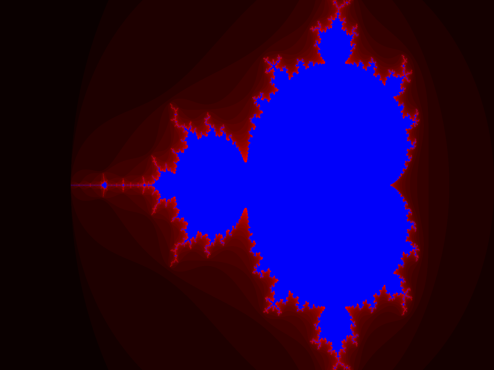
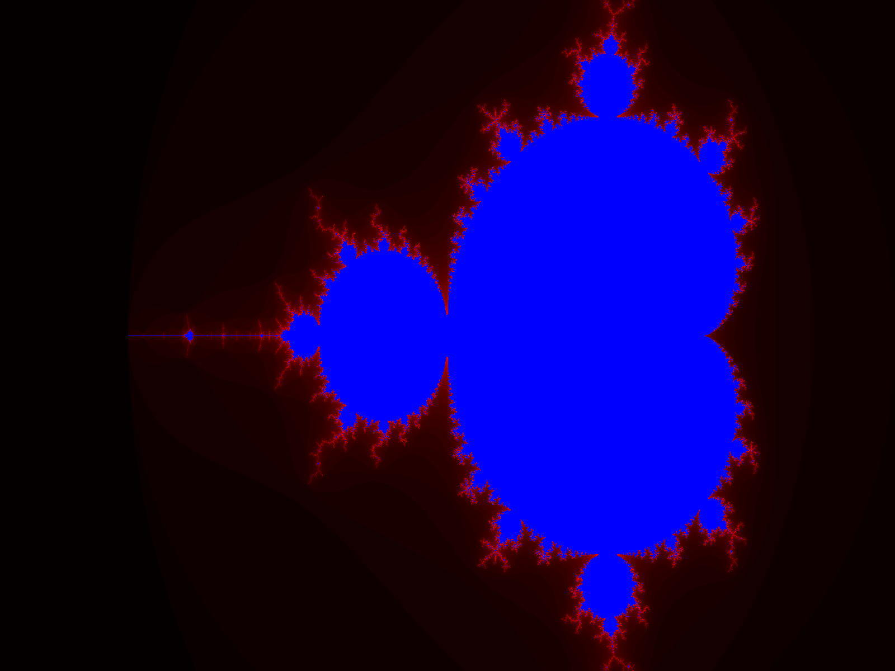

mandelbrot
==========

Mandelbrot fractal generator.

Requirements
------------
* Pillow

Usage
-----

<pre>
python mandelbrot.py -h
usage: mandelbrot.py [-h] -x WIDTH -y HEIGHT -i ITERATIONS -o OUTPUT

optional arguments:
  -h, --help            show this help message and exit
  -x WIDTH, --width WIDTH
  -y HEIGHT, --height HEIGHT
  -i ITERATIONS, --iterations ITERATIONS
  -o OUTPUT, --output OUTPUT
</pre>

Examples
--------

<pre>
python mandelbrot.py -x 1600 -y 1200 -i 10 -o mandelbrot_1600x1200_10.png
</pre>

<pre>
python mandelbrot.py -x 1600 -y 1200 -i 10 -o mandelbrot_1600x1200_25.png
</pre>

<pre>
python mandelbrot.py -x 1600 -y 1200 -i 10 -o mandelbrot_1600x1200_50.png
</pre>

